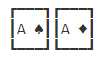

# *CDeck*



# Introduction

*CDeck* is a C library that allows the creation and usage of cards in C. It Allows you to print both sides of the cards.


## The *Card* component

There is a *Card* component that is a *struct* with the following structure:

```C
typedef struct Card{
    card_suites suite;
    int value;
} Card;
```


The card value is an integer and the equivalent list is on the table below.

| int value | Card equivalent |
| --------- | --------------- |
| 1         | A               |
| 2         | 2               |
| 3         | 3               |
| 4         | 4               |
| 5         | 5               |
| 6         | 6               |
| 7         | 7               |
| 8         | 8               |
| 9         | 9               |
| 10        | 10              |
| 11        | J               |
| 12        | Q               |
| 13        | K               |


The card suite is an enum called card_suites. It's defined by:

```C
typedef enum card_suites{
    SPADES, CLUBS, HEARTS, DIAMONDS
} card_suites;
```


If you want to see all cards fronts, please read [CARDS.txt](CARDS.txt)

There is also card backs, you can see then in [CARDBACKS.txt](CARDBACKS.txt)


## Functions

If you want to see all functions, please read [FUNCTIONS.md](FUNCTIONS.md)


## How to use

You can build as a library (see [Makefile](Makefile)) or you can just copy the source code to your project.


## License

This product is licensed under the MIT License.
